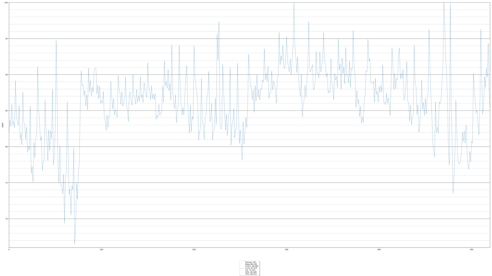

# Plot_Vmaf
This script is a combination of forking
[master-of-zen/Plot_Vmaf](https://github.com/master-of-zen/Plot_Vmaf) and
combining it with the live motion graphing from my own repository
[HunterAP23/GameBench_Graph_Maker](https://github.com/HunterAP23/GameBench_Graph_Maker).

This will generate a single image to show the VMAF values for the inputted VMAF
file overall, and generate a video file that is animated to move through the
graph, both at the same framerate (as reported by the source VMAF report) and
has a transparent background.


## Usage
```bash
python plot_vmaf.py [-h] [-o OUTPUT] vmaf_file
```

## Example
```bash
python plot_vmaf.py vmaf.xml -o plot.svg
```

## Options
```
-o --output ["file"]    Graph output file, file extension will change type of output (default plot.png)
```

## Requirements
Python 3  
Matplotlib  
Numpy

Install them with either of the following commands:
```
pip install -r requirements.txt
```
OR
```
python -m pip install -r requirements.txt
```
